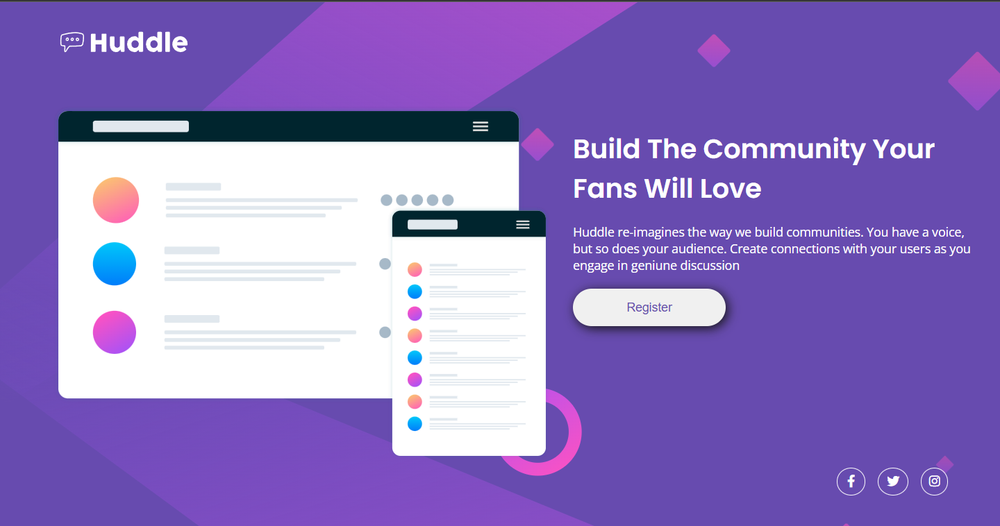

### Desafio Curso DevQuest - HTML + CSS Avançado

O aluno deve criar um layout parecido com o proposto, em diferentes resoluções:

- O resultado deve ficar o mais próximo possível, utilizando dos conhecimentos aprendido no curso DevQuest
- O projeto deve ser adicionado ao GitHub e será corrigido pelo mentor do curso.

### Screenshot

## Meu processo:

- Tive dificuldades na parte responsiva, fiquei bastante tempo até conseguir um resultado que me deixou satisfeito.

### Tecnologias utilizadas:

- HTML5 semântico
- CSS3 responsivo
- Flexbox

### Meu aprendizado:

Aprendi à dividir um problema em partes, resolvendo cada parte por vez até conseguir o melhor resultado possível.
Como melhorar a responsividade com o CSS.

### Recursos extras:

- [Google Fonts](https://fonts.google.com) - Utilizei fontes do Google Fonts nos textos.
- [Font Awesome](https://fontawesome.com) - Utilizei ícones do Font Awesome para os ícones de redes sociais.

## Author:

- Linkedin - [John Dalton](https://www.linkedin.com/in/john-dalton-dev/)

## Créditos:

- Mentores do curso - [Dev em Dobro](https://github.com/devemdobro)